# RT Video Learning Analytics

Nền tảng học video trực tuyến (LMS) phân quyền **Student / Instructor / Admin**, thu thập sự kiện học tập theo thời gian thực, dashboard phân tích hành vi, dự đoán nguy cơ bỏ học (dropout), phân cụm learning style, gợi ý khóa học, pipeline MLOps (DVC + MLflow + XGBoost/KMeans) và stack observability (Prometheus + Grafana) + CI/CD Jenkins.


---

## Mục lục

- [Tổng quan](#tổng-quan)
- [Tính năng chính](#tính-năng-chính)
- [Công nghệ sử dụng](#công-nghệ-sử-dụng)
- [Cấu trúc thư mục](#cấu-trúc-thư-mục)
- [Sơ đồ kiến trúc](#sơ-đồ-kiến-trúc)
- [Mô hình dữ liệu chính](#mô-hình-dữ-liệu-chính)
- [Luồng hoạt động chi tiết](#luồng-hoạt-động-chi-tiết)
  - [1. Luồng đăng ký + xác thực JWT](#1-luồng-đăng-ký--xác-thực-jwt)
  - [2. Luồng đăng nhập Google OAuth](#2-luồng-đăng-nhập-google-oauth)
  - [3. Luồng quên / đổi mật khẩu](#3-luồng-quên--đổi-mật-khẩu)
  - [4. Luồng instructor apply + admin approval](#4-luồng-instructor-apply--admin-approval)
  - [5. Luồng tạo khóa học và upload video](#5-luồng-tạo-khóa-học-và-upload-video)
  - [6. Luồng enroll + học video + capture event](#6-luồng-enroll--học-video--capture-event)
  - [7. Luồng tính engagement, at-risk và inference dropout](#7-luồng-tính-engagement-at-risk-và-inference-dropout)
  - [8. Luồng learning style clustering](#8-luồng-learning-style-clustering)
  - [9. Luồng course recommendation](#9-luồng-course-recommendation)
  - [10. Luồng instructor analytics dashboard](#10-luồng-instructor-analytics-dashboard)
  - [11. Luồng admin moderation + audit](#11-luồng-admin-moderation--audit)
  - [12. Luồng MLOps end-to-end (DVC + MLflow)](#12-luồng-mlops-end-to-end-dvc--mlflow)
  - [13. Luồng monitoring (Prometheus + Grafana)](#13-luồng-monitoring-prometheus--grafana)
  - [14. Luồng CI/CD (Jenkins) + deploy.ps1](#14-luồng-cicd-jenkins--deployps1)
- [API tham chiếu](#api-tham-chiếu)
- [Biến môi trường](#biến-môi-trường)
- [Cài đặt theo HĐH](#cài-đặt-theo-hđh)
- [Chạy từng công nghệ](#chạy-từng-công-nghệ)
- [Docker Compose](#docker-compose)
- [MLOps pipeline](#mlops-pipeline)
- [Monitoring](#monitoring)
- [CI/CD](#cicd)
- [Testing](#testing)
- [Troubleshooting](#troubleshooting)
- [Bảo mật](#bảo-mật)

---

## Tổng quan

`RT Video Learning Analytics` là một LMS hướng phân tích hành vi. Khác với LMS truyền thống chỉ quan tâm progress %, hệ thống bóc tách hành vi xem video xuống cấp độ sự kiện (play, pause, seek, skip, rate change, note, tab hidden, fullscreen…) và biến chúng thành **feature store** cho ML.

Ba vai trò:

- **Student** → enroll khóa học, xem video, viết note theo timestamp, được gợi ý khóa học và nhận cảnh báo khi đang ở trạng thái có nguy cơ bỏ học.
- **Instructor** → tạo khóa học/video, theo dõi dashboard hành vi, heatmap watch time per video, danh sách học viên at-risk, gửi thông báo can thiệp.
- **Admin** → moderation, approve instructor, system settings, audit log.

Tách module:

| Module           | Vai trò                                                                       |
| ---------------- | ----------------------------------------------------------------------------- |
| `frontend/`      | SPA React 19 + Vite cho cả 3 role, Axios + JWT, build → Nginx serve           |
| `backend/`       | Django 5.2 REST API, JWT, ORM Postgres, Prometheus, APScheduler              |
| `mlops/`         | DVC pipeline + MLflow + scikit-learn/XGBoost, drift PSI, model registry      |
| `monitoring/`    | Prometheus scrape `/metrics`, Grafana provisioning dashboards                |
| `jenkins/`       | Jenkins Dockerfile + `Jenkinsfile` pipeline build → smoke test → marker      |
| `deploy.ps1`     | Polling-deploy script trên host Windows: phát hiện build green → docker compose up |
| `docker-compose.yml` | Orchestration backend/frontend/prometheus/grafana/jenkins (profile `cd`) |

---

## Tính năng chính

### Người dùng & phân quyền

- Đăng ký, đăng nhập email/password JWT (access 15 phút, refresh 7 ngày, blacklist sau rotate).
- Đăng nhập Google OAuth qua django-allauth.
- Forgot password 3 bước: send OTP → verify OTP → reset.
- Đổi mật khẩu khi đã đăng nhập.
- Hồ sơ `/api/auth/me/`.
- Apply instructor profile → admin approve / reject.

### Khóa học

- CRUD category (admin).
- CRUD course (instructor), public list/detail.
- Enroll (student) tạo `CourseEnrollment`.
- "Khóa học của tôi" (student) và "Khóa học tôi dạy" (instructor).
- Wishlist, review, discussion thread + reply, report khóa học, certificate, learning goals.

### Video learning

- Upload video → Cloudinary storage (`backend/videos/storage.py`).
- `VideoProgress` (unique theo `student × video`), `VideoNote` (theo timestamp).
- Stream qua `/api/videos/<id>/stream/` hoặc trực tiếp Cloudinary URL.
- "Continue watching" gom các video chưa hoàn thành gần đây.

### Analytics & ML

- 11 loại event: `play`, `pause`, `ended`, `seek`, `skip_forward_10`, `skip_backward_10`, `rate_change`, `note_created`, `note_updated`, `note_deleted`, `progress_sync`.
- Mỗi event gắn `session_id`, vị trí video (`position_seconds`), `delta_seconds`, `playback_rate`, `is_tab_hidden`, `is_fullscreen`, `volume`, `metadata` JSON.
- Engagement score + label theo session/khóa học.
- At-risk students per course (lookup theo dropout model + heuristic).
- Video heatmap (mật độ re-watch theo từng giây).
- Learning style clustering (KMeans).
- Course recommendation: per-course + personalized hybrid (collaborative + content-based).
- Reload model serving runtime mà không restart container (`/api/analytics/dropout-model/reload/`).

### MLOps

- 7 stage DVC: `extract` → `validate` → `features` → `drift` → `train_dropout` → `train_style` → `train_recommender` → `register`.
- Tracking + experiment + model registry MLflow (`sqlite:///mlflow.db` mặc định).
- Drift report PSI.
- Mock data generators (5 management commands) cho dev không có dữ liệu thật.

### DevOps / Observability

- Dockerfile cho backend (slim deps `requirements.docker.txt`) + frontend (Nginx Alpine).
- Compose 5 service, profile `cd` để bật Jenkins.
- Prometheus scrape `/metrics` (django-prometheus + 3 custom counter/histogram).
- Grafana provisioning sẵn 2 dashboard: `system.json`, `mlops.json`.
- Jenkins pipeline + `deploy.ps1` watcher trên host.

---

## Công nghệ sử dụng

### Backend

| Nhóm          | Công nghệ                                                          |
| ------------- | ------------------------------------------------------------------ |
| Framework     | Python 3.11, Django 5.2, Django REST Framework                     |
| Auth          | SimpleJWT (rotate + blacklist), django-allauth, Google OAuth       |
| Database      | PostgreSQL (Supabase pooler khuyến nghị), psycopg2-binary, `sslmode=require` |
| Storage       | Cloudinary, `django-cloudinary-storage` + custom large-video chunker |
| API docs      | `drf-spectacular`, Swagger UI tại `/api/docs/`                     |
| Static        | WhiteNoise                                                          |
| Metrics       | `django-prometheus` (DB engine wrapper + middleware), 3 custom metric |
| Scheduler     | `django-apscheduler` — daily refresh model cache (02:15)           |
| ML serving    | scikit-learn, XGBoost, joblib                                       |

### Frontend

| Nhóm        | Công nghệ                          |
| ----------- | ---------------------------------- |
| UI          | React 19                           |
| Build       | Vite                               |
| Routing     | React Router DOM 7                 |
| HTTP        | Axios + interceptor refresh token  |
| Icons       | lucide-react                       |
| Serve prod  | Nginx Alpine (SPA fallback + `/api` proxy) |

### MLOps / Data

| Nhóm        | Công nghệ                                                |
| ----------- | -------------------------------------------------------- |
| Pipeline    | DVC (S3 remote optional)                                  |
| Tracking    | MLflow (SQLite hoặc HTTP backend)                        |
| Models      | XGBoost (dropout), KMeans (style), Hybrid Recommender    |
| Validation  | Great Expectations                                        |
| Drift       | PSI thủ công, dependency Evidently                       |
| Artifacts   | `data/`, `models/`, `metrics/`, `reports/`, `mlruns/`    |

### Monitoring / CI-CD

| Nhóm        | Công nghệ                                  |
| ----------- | ------------------------------------------ |
| Metrics     | Prometheus 9090                            |
| Dashboard   | Grafana 3000                               |
| CI/CD       | Jenkins 8080 (profile `cd`)                 |
| Container   | Docker, Docker Compose v2                  |
| Deploy host | `deploy.ps1` polling marker file           |

---

## Cấu trúc thư mục

```text
.
├── backend/                          # Django backend
│   ├── core/                         # Settings, URLs, ASGI/WSGI
│   │   ├── settings.py               # config() từ python-decouple
│   │   └── urls.py                   # /health, /metrics, /api/*, /admin, allauth
│   ├── users/                        # User, StudentProfile, InstructorProfile + JWT
│   ├── courses/                      # Category, Course, CourseEnrollment
│   ├── videos/                       # Video, VideoNote, VideoProgress + Cloudinary
│   ├── analytics/                    # LearningEvent/Session + ML serving
│   │   ├── ml/                       # features.py, labels.py, schemas.py, registry
│   │   ├── ml_engine.py              # engagement, risk score, heatmap
│   │   ├── dropout_predictor.py      # XGBoost inference wrapper
│   │   ├── learning_style.py         # KMeans clustering
│   │   ├── recommender.py            # Hybrid recommender
│   │   ├── scheduler.py              # APScheduler daily cache refresh
│   │   ├── services/dropout_service.py # predict / reload / status singleton
│   │   └── management/commands/      # mock data + train commands
│   ├── api/                          # Admin/notification/wishlist/discussion/...
│   ├── Dockerfile
│   ├── entrypoint.sh                 # collectstatic → gunicorn
│   └── manage.py
├── frontend/
│   ├── src/
│   │   ├── api/                      # Axios client + interceptors
│   │   ├── context/                  # AuthContext
│   │   ├── pages/
│   │   │   ├── auth/                 # Login, Register, ForgotPassword
│   │   │   ├── public/               # Landing, courses
│   │   │   ├── student/              # Dashboard, MyCourses, LearningHub, CourseLearn, Profile
│   │   │   ├── instructor/           # Dashboard, Courses, Videos, Analytics, Students, Categories
│   │   │   └── admin/                # Dashboard, Management
│   │   └── components/, hooks/, utils/
│   ├── nginx.conf                    # SPA fallback + proxy /api → backend:8000
│   └── Dockerfile                    # Vite build → Nginx Alpine
├── mlops/
│   ├── config/mlops.yaml             # MLflow, dropout/style/recommender params, drift threshold
│   ├── pipelines/
│   │   ├── 01_extract.py             # Django ORM → data/raw/*.parquet
│   │   ├── 02_validate.py            # → reports/data_validation.json
│   │   ├── 03_features.py            # → data/processed/dropout_features.parquet
│   │   ├── 04_train_dropout.py       # XGBoost → models/dropout/ + MLflow
│   │   ├── 05_train_style.py         # KMeans → models/style/ + MLflow
│   │   ├── 06_train_recommender.py   # Hybrid → models/recommender/ + MLflow
│   │   └── 08_registrer.py           # Promote → MLflow registry
│   ├── monitoring/drift.py           # PSI → reports/drift_report.json
│   └── serving/model_loader.py       # MLflow URI hoặc local fallback
├── monitoring/
│   ├── prometheus/prometheus.yml     # scrape backend:8000/metrics
│   └── grafana/provisioning/
│       ├── datasources/datasource.yml
│       └── dashboards/{dashboard.yml, system.json, mlops.json}
├── jenkins/
│   ├── Dockerfile                    # jenkins/jenkins:lts-jdk17 + docker-cli
│   ├── plugins.txt
│   └── Jenkinsfile                   # checkout → dvc pull → lint → test → build → smoke → marker
├── scripts/                          # helper scripts
├── data/, models/, metrics/, reports/, mlruns/, mlflow.db   # ML artifacts (DVC tracked)
├── docker-compose.yml                # backend, frontend, prometheus, grafana, jenkins
├── dvc.yaml + dvc.lock               # DVC stages
├── deploy.ps1                        # Watcher trên host: poll Jenkins marker → compose up
├── requirements.txt                  # Full deps (dev + MLOps)
├── requirements.docker.txt           # Lean deps cho image backend
└── README.md
```

---

## Sơ đồ kiến trúc

### Kiến trúc tổng thể

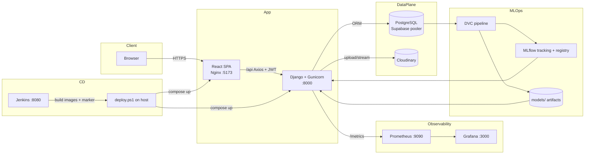

### Backend modules

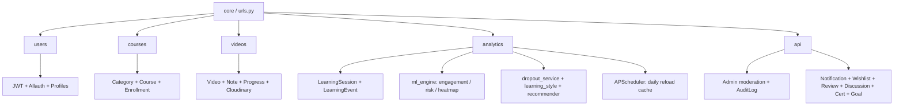

### Docker runtime

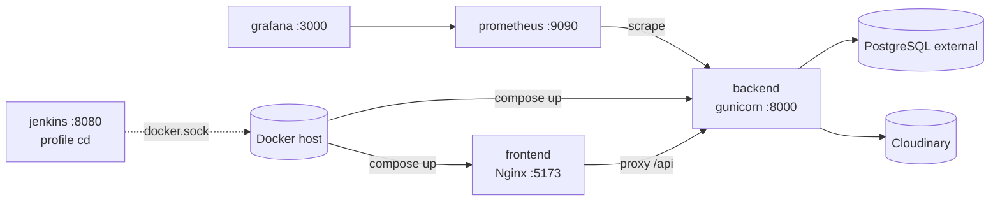

---

## Mô hình dữ liệu chính

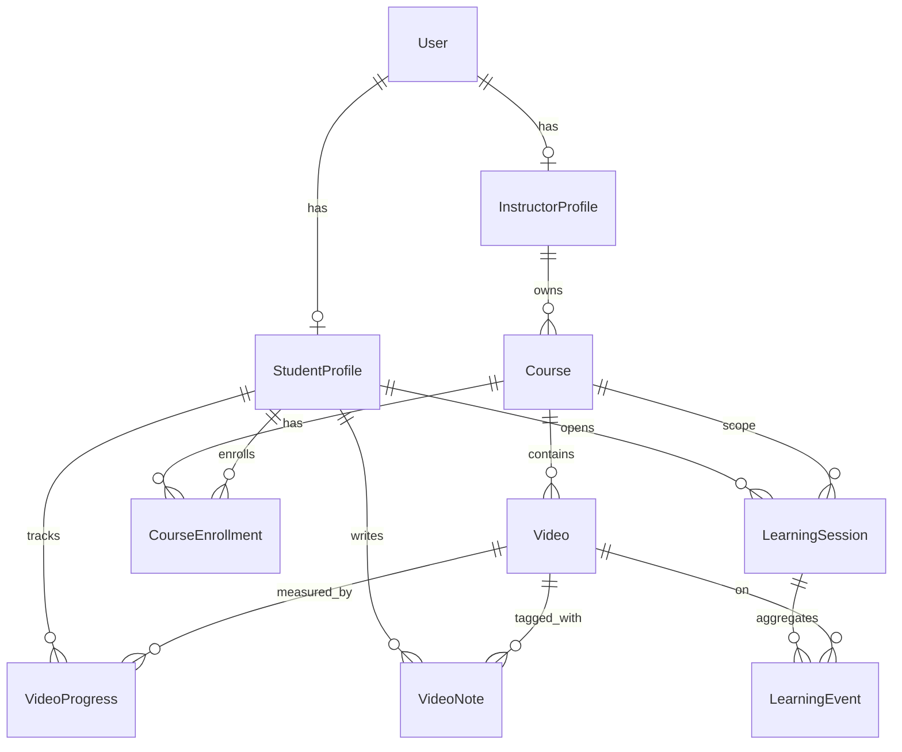

Trích các bảng quan trọng (rút gọn):

```text
users.User(user_id UUID PK, email UNIQUE, full_name, role={student|instructor|admin}, is_email_verified, last_login_at, ...)
users.StudentProfile(user OneToOne PK, country, timezone, last_active_at, ...)
users.InstructorProfile(user OneToOne PK, headline, is_verified, total_students, avg_rating, ...)

videos.Video(video_id, course FK, title, video_file Cloudinary, video_url, duration_seconds, order UNIQUE per course, is_published)
videos.VideoProgress(student FK, video FK, watched_seconds, duration_seconds, completed, last_watched_at)   -- UNIQUE(student, video)
videos.VideoNote(video FK, student FK, timestamp_seconds, content)

analytics.LearningSession(session_id PK, student FK, course FK, started_at, ended_at, active_seconds, idle_seconds, event_count, device_type, browser, user_agent)
analytics.LearningEvent(event_id, student FK, course FK, video FK, session FK, event_type,
                        position_seconds, from_seconds, to_seconds, delta_seconds,
                        playback_rate, client_timestamp, duration_ms,
                        is_tab_hidden, is_fullscreen, volume, muted, metadata JSON)
```

Index quan trọng cho analytics: `(course, created_at)`, `(video, event_type)`, `(student, course)` trên `LearningEvent`.

---

## Luồng hoạt động chi tiết

### 1. Luồng đăng ký + xác thực JWT

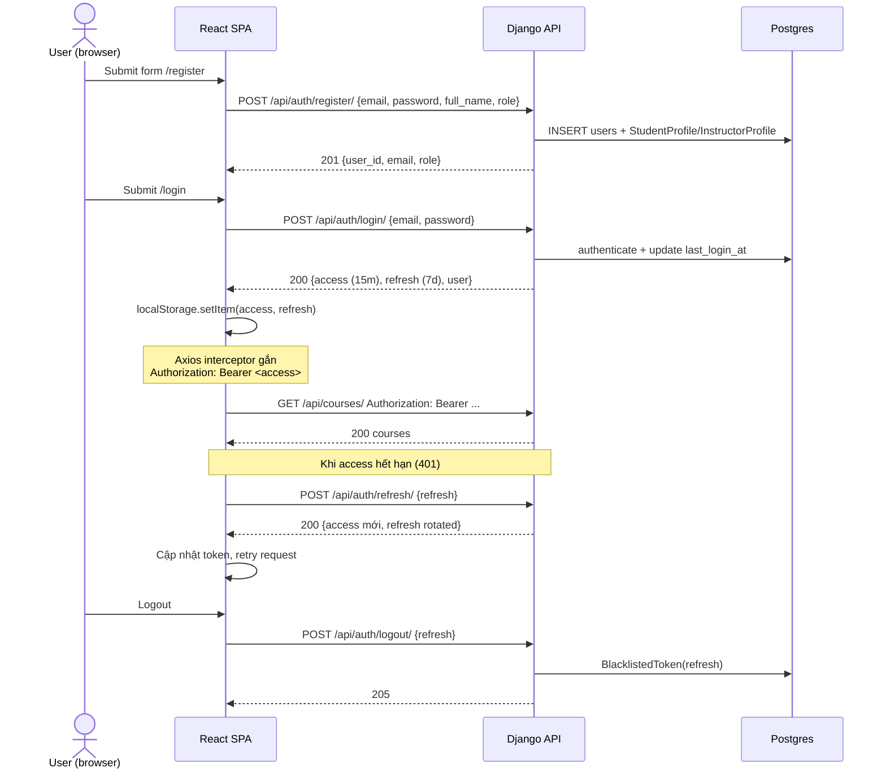

Đặc tả token: `ACCESS_TOKEN_LIFETIME=15m`, `REFRESH_TOKEN_LIFETIME=7d`, `ROTATE_REFRESH_TOKENS=True`, `BLACKLIST_AFTER_ROTATION=True`, `USER_ID_CLAIM=user_id`.

### 2. Luồng đăng nhập Google OAuth

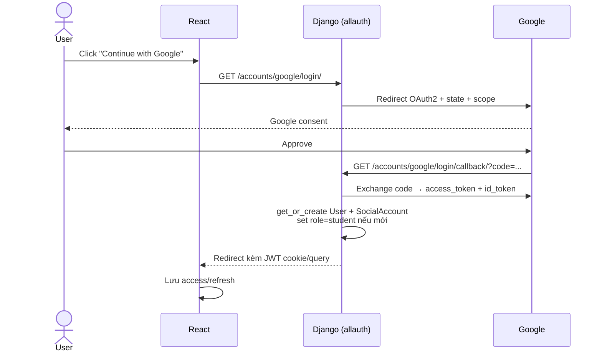

Cấu hình ở [`backend/core/settings.py`](backend/core/settings.py): `SOCIALACCOUNT_PROVIDERS.google.APP.{client_id, secret}` lấy từ env.

### 3. Luồng quên / đổi mật khẩu

Forgot password (3 bước):

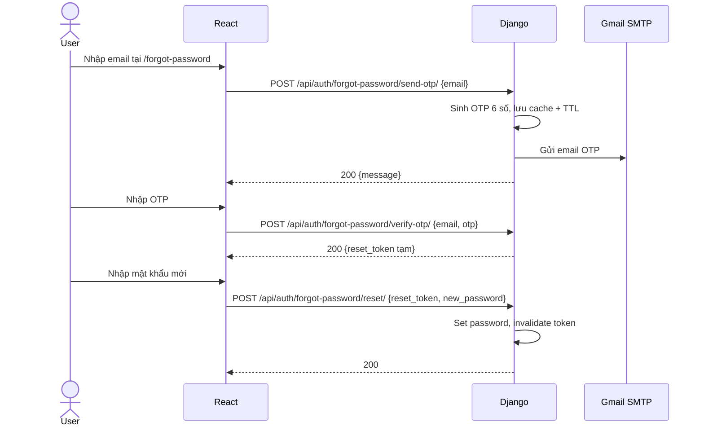

Change password (đã đăng nhập): `POST /api/auth/change-password/ {old_password, new_password}` với `Authorization`.

### 4. Luồng instructor apply + admin approval

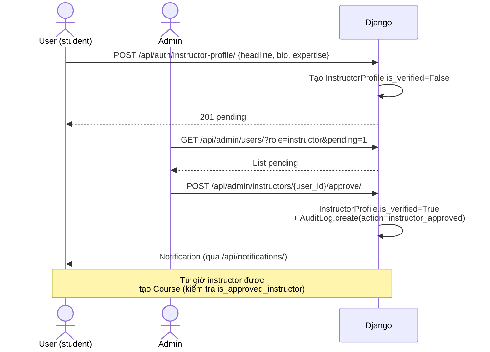

Kiểm tra ở [`backend/courses/views.py`](backend/courses/views.py) qua `is_approved_instructor(user)` → ngăn tạo khóa học nếu chưa được duyệt.

### 5. Luồng tạo khóa học và upload video

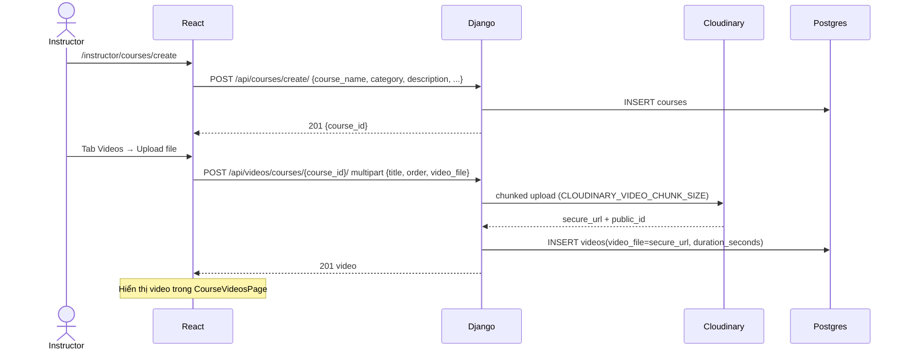

Storage class custom: [`backend/videos/storage.py`](backend/videos/storage.py) (`LargeVideoCloudinaryStorage`) — chunked để upload file lớn không OOM.

### 6. Luồng enroll + học video + capture event

Đây là luồng quan trọng nhất, sinh dữ liệu cho ML.

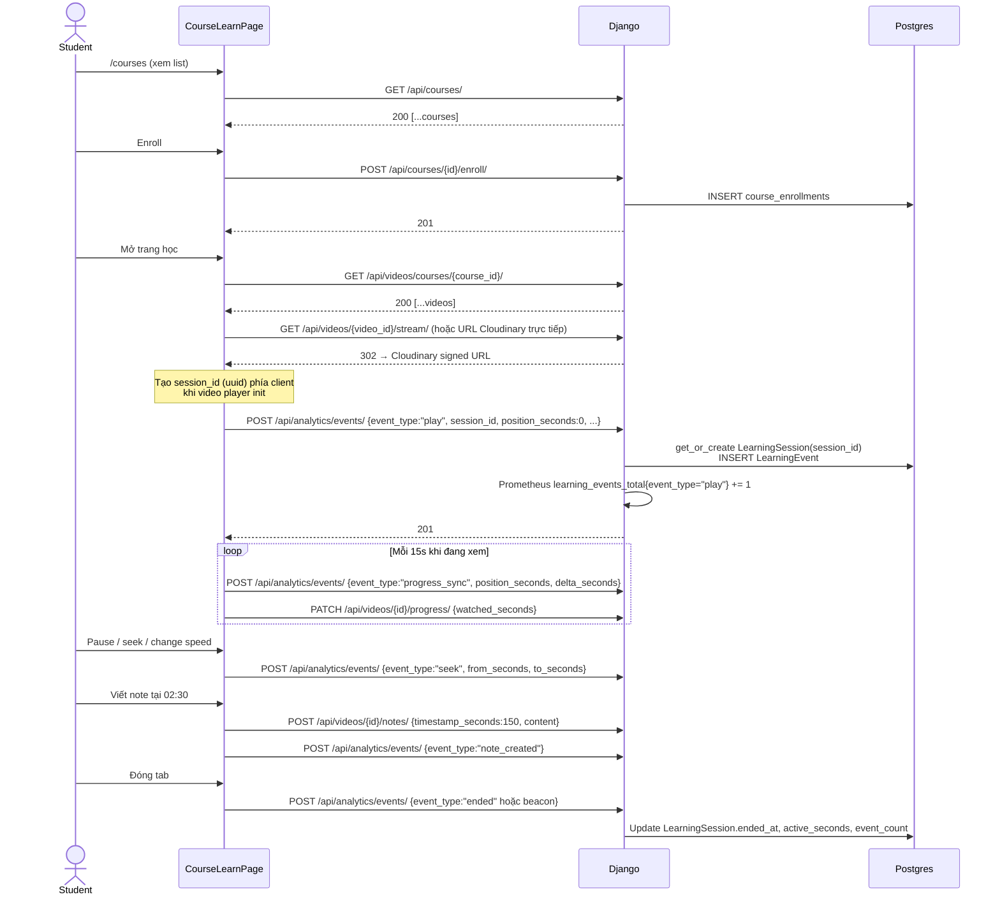

Shape event payload (rút gọn):

```json
{
  "event_type": "seek",
  "session_id": "0fc6e7c8-...-9a2",
  "course_id": 14,
  "video_id": 88,
  "position_seconds": 423,
  "from_seconds": 240,
  "to_seconds": 423,
  "delta_seconds": 183,
  "playback_rate": 1.5,
  "client_timestamp": "2026-05-23T09:35:00Z",
  "duration_ms": 320,
  "is_tab_hidden": false,
  "is_fullscreen": true,
  "volume": 0.8,
  "muted": false,
  "metadata": {"player_version": "v2.1"}
}
```

Server-side handler [`backend/analytics/views.py:LearningEventCreateView`](backend/analytics/views.py): validate type ∈ `EventType.choices`, resolve `student`/`course`/`video`, upsert `LearningSession`, increment metric `learning_events_total{event_type=...}`.

### 7. Luồng tính engagement, at-risk và inference dropout

Có 2 nhánh: **realtime** (compute trực tiếp từ DB khi gọi API) và **offline** (model XGBoost đã train).

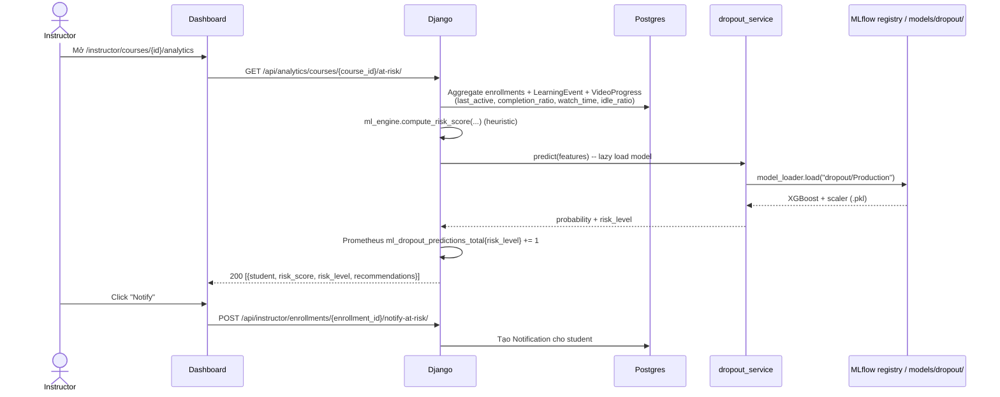

Cache model: model được load **một lần** trong worker, lưu singleton trong `dropout_service`. Có 2 cách invalidate:

- Cron daily 02:15 [`backend/analytics/scheduler.py`](backend/analytics/scheduler.py) → gọi `reload()`.
- Gọi `POST /api/analytics/dropout-model/reload/` (admin) — dùng sau khi promote model mới trong MLflow registry.
- Trạng thái: `GET /api/analytics/dropout-model/status/`.

### 8. Luồng learning style clustering

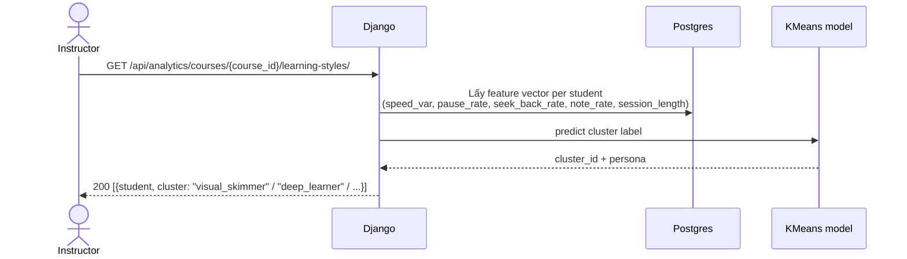

Model file: `models/style/kmeans.pkl`. Train offline qua [`mlops/pipelines/05_train_style.py`](mlops/pipelines/05_train_style.py).

### 9. Luồng course recommendation

Có 2 endpoint:

- **Per-course** `GET /api/analytics/courses/{course_id}/recommendations/` — gợi ý khóa học liên quan cho người đang xem khóa.
- **Personalized** `GET /api/analytics/courses/personalized-recommendations/` — top-K cá nhân hóa.

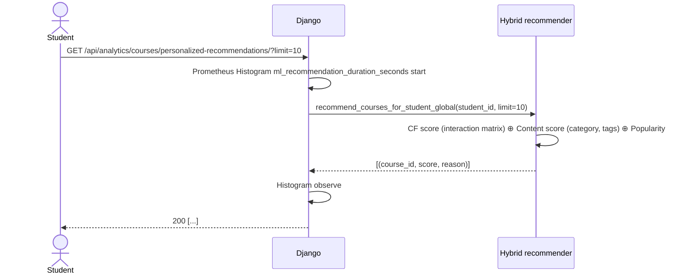

Train offline ở [`mlops/pipelines/06_train_recommender.py`](mlops/pipelines/06_train_recommender.py), output `models/recommender/hybrid.pkl`.

### 10. Luồng instructor analytics dashboard

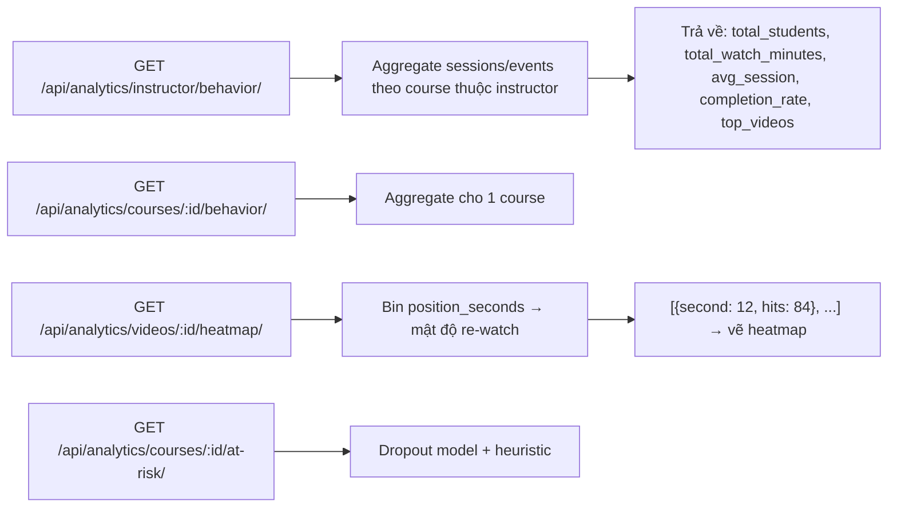

UI tương ứng: [`frontend/src/pages/instructor/CourseAnalyticsPage.jsx`](frontend/src/pages/instructor/CourseAnalyticsPage.jsx), [`InstructorDashboard.jsx`](frontend/src/pages/instructor/InstructorDashboard.jsx), [`InstructorStudentsPage.jsx`](frontend/src/pages/instructor/InstructorStudentsPage.jsx).

### 11. Luồng admin moderation + audit

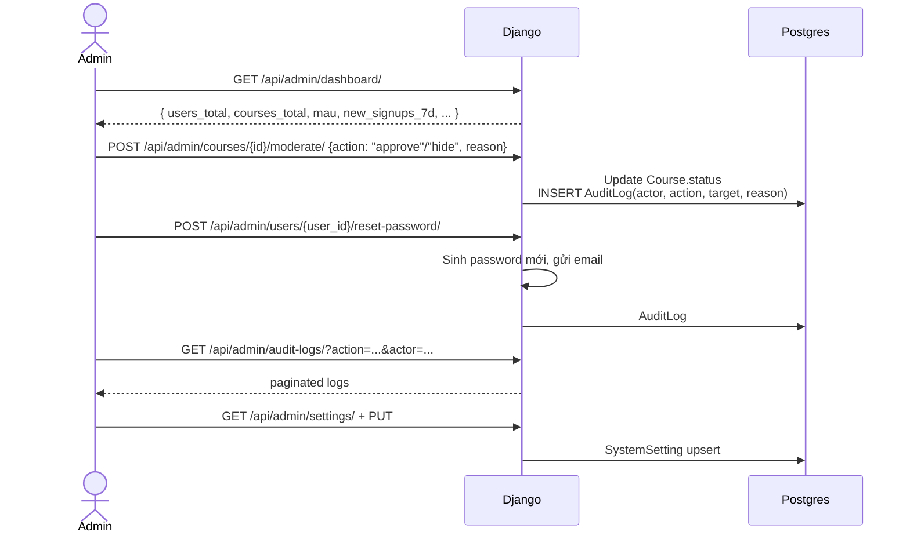

### 12. Luồng MLOps end-to-end (DVC + MLflow)

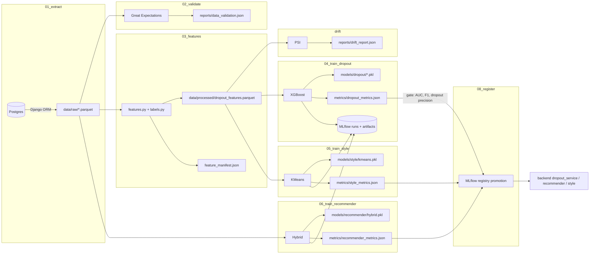

Vòng tròn data → model → serving:

1. `dvc repro extract` → đọc Django ORM (cần `backend/.env` đúng) → ghi `data/raw/`.
2. `dvc repro validate` → schema check, nếu fail thì pipeline dừng.
3. `dvc repro features` → cộng dồn event theo cửa sổ `lookback_days` (param trong `mlops/config/mlops.yaml`) → 1 parquet feature + manifest.
4. `dvc repro drift` → so feature mới với baseline → PSI per cột → fail nếu `PSI > monitoring.threshold`.
5. `dvc repro train_dropout` / `train_style` / `train_recommender` → tạo MLflow run, log params/metrics/artifacts, ghi `.pkl` cục bộ.
6. `dvc repro register` → đọc `metrics/*.json`, so promotion gate trong `mlops.yaml`, nếu pass → `mlflow.register_model` + transition stage `Staging` → `Production`.
7. Backend phát hiện model mới qua:
   - APScheduler cron 02:15 daily → `reload()`.
   - Hoặc gọi tay `POST /api/analytics/dropout-model/reload/`.
8. Next request → `model_loader.load("models:/dropout/Production")` từ MLflow, fallback local `models/dropout/` nếu MLflow URI rỗng.

Lệnh chạy nhanh:

```bash
dvc repro                    # toàn bộ
dvc repro train_dropout      # 1 stage
dvc dag                      # xem dependency
dvc pull                     # kéo artifact từ remote S3 nếu có
mlflow ui --backend-store-uri sqlite:///mlflow.db --port 5000
```

### 13. Luồng monitoring (Prometheus + Grafana)

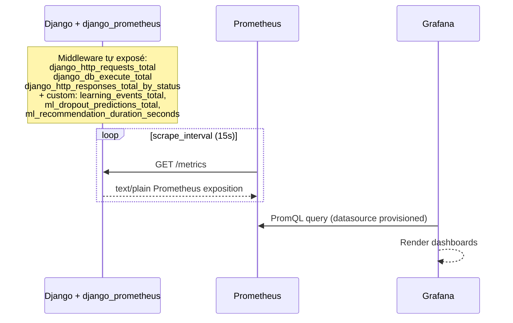

Dashboard provisioned (load lúc container start):

- `monitoring/grafana/provisioning/dashboards/system.json` — request rate, latency P95, DB query rate, response status mix.
- `monitoring/grafana/provisioning/dashboards/mlops.json` — `learning_events_total`, `ml_dropout_predictions_total` per risk level, recommendation latency histogram.

### 14. Luồng CI/CD (Jenkins) + deploy.ps1

```mermaid
flowchart LR
    DEV[Push to main] --> JK[Jenkins poll/webhook]
    subgraph Pipeline
        JK --> CK[Checkout]
        CK --> DV[Pull DVC artifacts AWS creds]
        DV --> LN[Lint backend]
        LN --> TS[Pytest backend]
        TS --> BL[Build image backend + frontend]
        BL --> SM[Smoke test rt-backend:tag /health/]
        SM --> MK[Ghi /var/jenkins_home/last-green-build = BUILD_NUMBER]
    end
    MK --> WATCH[deploy.ps1 trên host]
    subgraph Host
        WATCH -->|đọc marker từ jenkins-data volume| CMP[docker compose up -d --force-recreate backend frontend]
        CMP --> RUN[App live tại :8000 / :5173]
    end
```

Chi tiết stages [`jenkins/Jenkinsfile`](jenkins/Jenkinsfile):

1. **Checkout** + `git log -1 --oneline`.
2. **Pull DVC artifacts** — chạy container `python:3.11-slim`, gắn `--volumes-from $(hostname)` để vào workspace của Jenkins agent, pip install `dvc[s3]`, `dvc pull --allow-missing`. Dùng credential `aws-dvc` cho S3 remote.
3. **Lint backend** — `flake8 backend/ --max-line-length=120 --exit-zero` (non-blocking).
4. **Test backend** — `pytest backend/ -q --maxfail=1 || true` (non-blocking).
5. **Build images** — song song:
   - `docker build -t rt-backend:${BUILD_NUMBER} -t rt-backend:latest -f backend/Dockerfile .`
   - `docker build -t rt-frontend:${BUILD_NUMBER} -t rt-frontend:latest -f frontend/Dockerfile --build-arg VITE_API_URL="" .`
6. **Smoke test backend image** — chạy container với env stub (`SECRET_KEY=ci-smoke-key`, dummy DB/Google creds), poll `/health/` qua `python urllib` (do `python:3.11-slim` không có curl) tối đa 30s; nếu fail in log container và exit 1.
7. **Deploy marker** — ghi `BUILD_NUMBER` vào `/var/jenkins_home/last-green-build` (file này nằm trên volume `jenkins-data` của Docker).

Sau pipeline thành công, [`deploy.ps1`](deploy.ps1) trên host Windows làm phần còn lại:

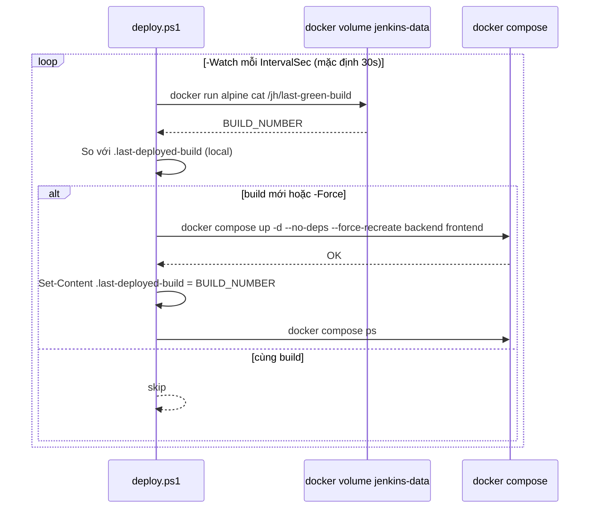

Cách dùng:

```powershell
.\deploy.ps1                    # deploy 1 lần nếu có build mới
.\deploy.ps1 -Force             # luôn deploy build mới nhất
.\deploy.ps1 -Watch              # poll mỗi 30s
.\deploy.ps1 -Watch -IntervalSec 10
```

---

## API tham chiếu

Tất cả endpoint authenticated yêu cầu `Authorization: Bearer <access>`. Swagger UI: `http://localhost:8000/api/docs/`.

### Auth `/api/auth/`

| Method | Path | Mô tả |
| ------ | ---- | ----- |
| POST | `register/` | Đăng ký |
| POST | `login/` | JWT login |
| POST | `logout/` | Blacklist refresh |
| POST | `refresh/` | Refresh access |
| POST | `change-password/` | Đổi mật khẩu |
| POST | `forgot-password/send-otp/` | Gửi OTP |
| POST | `forgot-password/verify-otp/` | Verify OTP |
| POST | `forgot-password/reset/` | Reset mật khẩu |
| GET  | `me/` | User hiện tại |
| POST | `instructor-profile/` | Apply instructor |

### Courses `/api/courses/`

| Method | Path | Mô tả |
| ------ | ---- | ----- |
| GET/POST | `categories/` | List/Create category |
| GET/PUT/DELETE | `categories/{id}/` | Chi tiết category |
| GET | `` | Public list course |
| GET | `{id}/` | Public detail |
| POST | `create/` | Tạo course (instructor) |
| PUT/DELETE | `{id}/manage/` | Sửa/xóa course |
| POST | `{id}/enroll/` | Enroll |
| GET | `my-course/` | Khóa học đã enroll |
| GET | `instructor-course/` | Khóa học instructor sở hữu |

### Videos `/api/videos/`

| Method | Path | Mô tả |
| ------ | ---- | ----- |
| GET/POST | `courses/{course_id}/` | List/Upload video |
| GET/PUT/DELETE | `{video_id}/` | Manage video |
| GET/PATCH | `{video_id}/progress/` | Video progress |
| GET/POST | `{video_id}/notes/` | List/Tạo note |
| PUT/DELETE | `notes/{note_id}/` | Sửa/xóa note |
| GET | `{video_id}/stream/` | Redirect stream Cloudinary |

### Analytics `/api/analytics/`

| Method | Path | Mô tả |
| ------ | ---- | ----- |
| POST | `events/` | Ghi learning event |
| GET | `instructor/behavior/` | Tổng quan instructor |
| GET | `courses/{course_id}/behavior/` | Hành vi 1 course |
| GET | `courses/{course_id}/at-risk/` | Danh sách at-risk |
| GET | `videos/{video_id}/heatmap/` | Heatmap re-watch |
| GET | `admin/behavior/` | Tổng quan admin |
| POST | `dropout-model/reload/` | Reload model serving |
| GET | `dropout-model/status/` | Trạng thái model |
| GET | `courses/{id}/learning-styles/` | Cluster style |
| GET | `courses/{id}/recommendations/` | Gợi ý liên quan |
| GET | `courses/personalized-recommendations/` | Gợi ý cá nhân |

### Auxiliary `/api/`

Notification, wishlist, review, certificate, learning goal, discussion, report, continue-watching, instructor students, admin dashboard/users/courses/audit/settings — xem [`backend/api/urls.py`](backend/api/urls.py).

### Hệ thống

| Path | Mô tả |
| ---- | ----- |
| `/health/` | Health check (JSON `{"status":"ok"}`) |
| `/metrics` | Prometheus exposition |
| `/admin/` | Django admin |
| `/api/docs/` | Swagger UI |
| `/api/schema/` | OpenAPI schema |
| `/accounts/google/login/` | Google OAuth start |

---

## Biến môi trường

Tạo `backend/.env` từ `.env.example`. **Không commit secret thật.** Nếu `SECRET_KEY` chứa `$`, để root `.env` không bị Compose hiểu nhầm thành biến, dùng `env_file.format: raw` (đã cấu hình sẵn) hoặc escape `$$`.

```env
# Django
SECRET_KEY=your-secret-key
DEBUG=True
ALLOWED_HOSTS=localhost,127.0.0.1
EXTRA_ALLOWED_HOSTS=backend

# Database (Supabase pooler khuyến nghị do settings dùng sslmode=require)
DB_NAME=postgres
DB_USER=postgres
DB_PASSWORD=your-db-password
DB_HOST=localhost
DB_PORT=5432

# Google OAuth
GOOGLE_CLIENT_ID=your-google-client-id
GOOGLE_CLIENT_SECRET=your-google-client-secret

# Email (forgot password OTP)
EMAIL_HOST_USER=your-email@gmail.com
EMAIL_HOST_PASSWORD=your-app-password

# Cloudinary
CLOUDINARY_CLOUD_NAME=your-cloud-name
CLOUDINARY_API_KEY=your-api-key
CLOUDINARY_API_SECRET=your-api-secret
CLOUDINARY_VIDEO_CHUNK_SIZE=52428800

# MLflow (rỗng = chỉ dùng local models/)
MLFLOW_TRACKING_URI=sqlite:///mlflow.db
```

Frontend dev (`frontend/.env.development`):

```env
VITE_API_URL=http://localhost:8000
```

Root `.env` cho Compose:

```env
GRAFANA_ADMIN_PASSWORD=change-me
```

---

## Cài đặt theo HĐH

### Windows

Yêu cầu: Windows 10/11, Python 3.11+, Node.js 20+, Git, Docker Desktop (nếu chạy container).

```powershell
git clone <repo-url>
cd rt-video-learning-analytics

python -m venv venv
.\venv\Scripts\Activate.ps1
python -m pip install --upgrade pip
pip install -r requirements.txt

Copy-Item .env.example backend\.env
# Sửa backend\.env

python backend\manage.py migrate
python backend\manage.py createsuperuser
python backend\manage.py runserver 0.0.0.0:8000
```

Frontend:

```powershell
cd frontend
npm install
npm run dev
```

Docker:

```powershell
docker compose up -d --build
docker compose ps
```

Nếu `entrypoint.sh` lỗi CRLF:

```powershell
$content = Get-Content backend\entrypoint.sh -Raw
[System.IO.File]::WriteAllText((Resolve-Path 'backend\entrypoint.sh'), ($content -replace "`r`n","`n"), [System.Text.UTF8Encoding]::new($false))
docker compose up -d --build backend
```

### macOS

```bash
brew install python@3.11 node git
git clone <repo-url> && cd rt-video-learning-analytics
python3.11 -m venv venv && source venv/bin/activate
pip install -r requirements.txt
cp .env.example backend/.env
python backend/manage.py migrate
python backend/manage.py runserver 0.0.0.0:8000
```

### Linux (Ubuntu/Debian)

```bash
sudo apt update
sudo apt install -y python3 python3-venv python3-pip git curl build-essential
curl -fsSL https://deb.nodesource.com/setup_20.x | sudo -E bash -
sudo apt install -y nodejs
git clone <repo-url> && cd rt-video-learning-analytics
python3 -m venv venv && source venv/bin/activate
pip install -r requirements.txt
cp .env.example backend/.env
python backend/manage.py migrate
python backend/manage.py runserver 0.0.0.0:8000
```

---

## Chạy từng công nghệ

### Django

```bash
python backend/manage.py runserver 0.0.0.0:8000
python backend/manage.py makemigrations
python backend/manage.py migrate
python backend/manage.py createsuperuser
python backend/manage.py collectstatic --noinput
python backend/manage.py check
curl http://localhost:8000/health/
```

Management commands hữu ích cho dev:

```bash
python backend/manage.py generate_mock_dropout_data
python backend/manage.py generate_mock_learning_styles
python backend/manage.py generate_mock_recommender_data
python backend/manage.py simulate_real_courses
python backend/manage.py train_dropout_model   # train inline (dev only)
python backend/manage.py reload_models
```

### React/Vite

```bash
cd frontend
npm install
npm run dev          # dev server :5173
npm run build        # build production → dist/
npm run preview      # preview build
npm run lint
```

### PostgreSQL local

```bash
createdb rt_video_learning
# backend/.env:
# DB_NAME=rt_video_learning  DB_HOST=localhost  DB_PORT=5432  DB_USER=postgres  DB_PASSWORD=postgres
```

Nếu Postgres local không có SSL, tắt `sslmode=require` trong [`backend/core/settings.py`](backend/core/settings.py) `DATABASES.default.OPTIONS`.

### Cloudinary

Đăng ký account → lấy `CLOUDINARY_CLOUD_NAME / API_KEY / API_SECRET`. `CLOUDINARY_VIDEO_CHUNK_SIZE` (bytes) ảnh hưởng tốc độ và memory upload.

### Prometheus / Grafana

```bash
docker compose up -d prometheus grafana
# http://localhost:9090   (Prometheus)
# http://localhost:3000   (Grafana, admin / admin hoặc GRAFANA_ADMIN_PASSWORD)
```

### Jenkins (profile cd)

```bash
docker compose --profile cd up -d --build jenkins
# http://localhost:8080
# Init password: docker exec rt-video-learning-analytics-jenkins-1 cat /var/jenkins_home/secrets/initialAdminPassword
```

### DVC

```bash
dvc dag
dvc repro
dvc repro train_dropout
dvc pull
```

### MLflow UI

```bash
mlflow ui --backend-store-uri sqlite:///mlflow.db --host 0.0.0.0 --port 5000
# http://localhost:5000
```

### Build image thủ công

```bash
docker build -f backend/Dockerfile -t rt-backend:dev .
docker run --env-file backend/.env -p 8000:8000 rt-backend:dev

docker build -f frontend/Dockerfile --build-arg VITE_API_URL="" -t rt-frontend:dev .
docker run -p 5173:80 rt-frontend:dev
```

---

## Docker Compose

```bash
docker compose up -d --build              # backend + frontend + prometheus + grafana
docker compose --profile cd up -d --build # thêm jenkins
docker compose ps
docker compose logs -f backend
docker compose restart backend
docker compose down                       # giữ volume
docker compose down -v                    # xóa volume
```

Service map:

| Service | Port | Image | Mô tả |
| ------- | ---: | ----- | ----- |
| `backend` | 8000 | build từ `backend/Dockerfile` | Django + Gunicorn |
| `frontend` | 5173 | build từ `frontend/Dockerfile` | Nginx phục vụ Vite build |
| `prometheus` | 9090 | `prom/prometheus:latest` | Scrape `/metrics` |
| `grafana` | 3000 | `grafana/grafana:latest` | Dashboard, provisioning sẵn |
| `jenkins` | 8080 | build từ `jenkins/Dockerfile` | CD pipeline, profile `cd` |

---

## MLOps pipeline

Stage map (từ [`dvc.yaml`](dvc.yaml)):

| Stage | Script | Inputs chính | Outputs chính |
| ----- | ------ | ------------ | ------------- |
| `extract` | `01_extract.py` | Django ORM | `data/raw/` |
| `validate` | `02_validate.py` | `data/raw/` | `reports/data_validation.json` |
| `features` | `03_features.py` | `data/raw/`, `analytics/ml/*` | `data/processed/dropout_features.parquet`, `feature_manifest.json` |
| `drift` | `monitoring/drift.py` | `data/processed/...` | `reports/drift_report.json` |
| `train_dropout` | `04_train_dropout.py` | features | `models/dropout/*.pkl`, `metrics/dropout_metrics.json`, MLflow run |
| `train_style` | `05_train_style.py` | features | `models/style/kmeans.pkl`, `metrics/style_metrics.json`, MLflow run |
| `train_recommender` | `06_train_recommender.py` | `data/raw/` | `models/recommender/hybrid.pkl`, `metrics/recommender_metrics.json`, MLflow run |
| `register` | `08_registrer.py` | metrics + models | Promotion trong MLflow registry |

File config: [`mlops/config/mlops.yaml`](mlops/config/mlops.yaml) — chứa `mlflow.tracking_uri`, `dropout.{lookback_days, params, threshold, promotion_gate}`, `learning_style.k`, `recommender.{cf_weight, content_weight}`, `monitoring.psi_threshold`.

---

## Monitoring

### Prometheus

- Config: [`monitoring/prometheus/prometheus.yml`](monitoring/prometheus/prometheus.yml)
- Target: `backend:8000`
- Path: `/metrics`
- Scrape interval: 15s

Custom metric (định nghĩa trong [`backend/analytics/views.py`](backend/analytics/views.py)):

- `learning_events_total{event_type}` — Counter, mỗi event POST tới `/api/analytics/events/`.
- `ml_dropout_predictions_total{risk_level}` — Counter, mỗi lần predict trả về risk.
- `ml_recommendation_duration_seconds` — Histogram, latency `recommend_courses_for_student_global`.

### Grafana

Provisioning:

```text
monitoring/grafana/provisioning/datasources/datasource.yml
monitoring/grafana/provisioning/dashboards/dashboard.yml
monitoring/grafana/provisioning/dashboards/system.json
monitoring/grafana/provisioning/dashboards/mlops.json
```

Login mặc định `admin/admin` — đổi qua `GRAFANA_ADMIN_PASSWORD`.

---

## CI/CD

File: [`jenkins/Jenkinsfile`](jenkins/Jenkinsfile). Đọc chi tiết tại mục [§14](#14-luồng-cicd-jenkins--deployps1).

Bật stack CD:

```bash
docker compose --profile cd up -d --build jenkins
# Bước đầu cấu hình:
#   1. Mở http://localhost:8080
#   2. Lấy initial admin password
#   3. Cài plugin gợi ý
#   4. New Item → Pipeline → SCM = repo URL, script path = jenkins/Jenkinsfile
#   5. Add credential aws-dvc (AWS access key + secret) nếu dùng S3 DVC remote
```

Trên host Windows, chạy watcher để auto-deploy build green:

```powershell
.\deploy.ps1 -Watch
```

---

## Testing

```bash
python -m compileall backend mlops          # sanity import
python backend/manage.py check               # Django checks
pytest backend/ -q                            # nếu có test

cd frontend
npm run lint
npm run build

# Docker
docker compose ps
curl http://localhost:8000/health/
curl http://localhost:8000/metrics | head
curl http://localhost:5173/
```

---

## Tài liệu nhanh

| Thành phần | URL local |
| ---------- | --------- |
| Frontend | <http://localhost:5173> |
| Backend API | <http://localhost:8000> |
| Swagger | <http://localhost:8000/api/docs/> |
| Django Admin | <http://localhost:8000/admin/> |
| Health | <http://localhost:8000/health/> |
| Metrics | <http://localhost:8000/metrics> |
| Prometheus | <http://localhost:9090> |
| Grafana | <http://localhost:3000> |
| Jenkins | <http://localhost:8080> |
| MLflow UI | <http://localhost:5000> |
