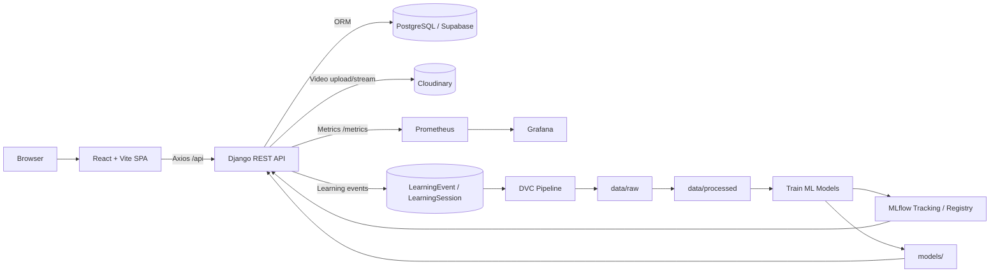
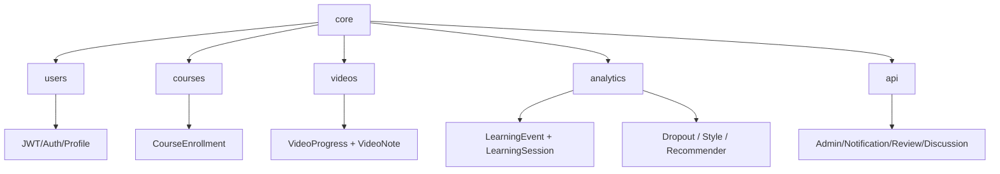
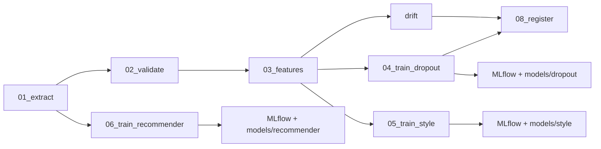
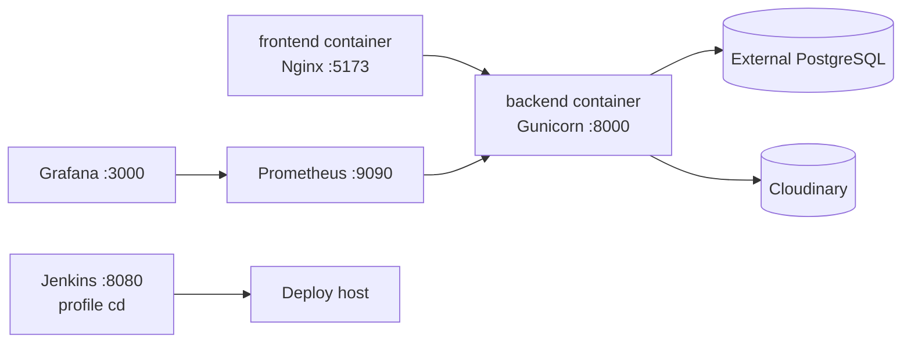

# RT Video Learning Analytics

Nền tảng học video trực tuyến có phân quyền Student / Instructor / Admin, theo dõi hành vi học tập theo thời gian thực, dashboard phân tích, dự đoán nguy cơ bỏ học, gợi ý khóa học, MLOps pipeline và hệ thống monitoring.


---

## Mục lục

- [Tổng quan](#tổng-quan)
- [Tính năng chính](#tính-năng-chính)
- [Công nghệ sử dụng](#công-nghệ-sử-dụng)
- [Cấu trúc thư mục](#cấu-trúc-thư-mục)
- [Sơ đồ kiến trúc](#sơ-đồ-kiến-trúc)
- [Luồng hoạt động](#luồng-hoạt-động)
- [API chính](#api-chính)
- [Biến môi trường](#biến-môi-trường)
- [Cài đặt trên Windows](#cài-đặt-trên-windows)
- [Cài đặt trên macOS](#cài-đặt-trên-macos)
- [Cài đặt trên Linux](#cài-đặt-trên-linux)
- [Cách chạy từng công nghệ](#cách-chạy-từng-công-nghệ)
- [Docker Compose](#docker-compose)
- [MLOps pipeline](#mlops-pipeline)
- [Monitoring](#monitoring)
- [CI/CD](#cicd)
- [Troubleshooting](#troubleshooting)

---

## Tổng quan

`RT Video Learning Analytics` là hệ thống LMS tập trung vào video learning analytics. Ứng dụng thu thập sự kiện học tập như xem video, pause, seek, thay đổi tốc độ, tạo ghi chú, hoàn thành video; từ đó cung cấp thống kê cho giảng viên/quản trị viên và tạo dữ liệu cho pipeline ML.

Hệ thống gồm:

- `frontend/`: SPA React + Vite cho Student, Instructor, Admin.
- `backend/`: Django REST API, JWT auth, quản lý khóa học/video/phân tích.
- `mlops/`: pipeline DVC/MLflow cho extract, validate, feature engineering, training, drift monitoring, registry.
- `monitoring/`: Prometheus + Grafana dashboard.
- `jenkins/`: Jenkinsfile và Docker image phục vụ CD.
- `docker-compose.yml`: chạy backend, frontend, Prometheus, Grafana, Jenkins.

---

## Tính năng chính

### Người dùng & phân quyền

- Đăng ký, đăng nhập JWT, refresh token, logout.
- Quên mật khẩu qua OTP email.
- Hồ sơ người dùng, đổi mật khẩu.
- Vai trò: `student`, `instructor`, `admin`.
- Instructor profile apply/approval flow.

### Khóa học

- Danh mục khóa học.
- Danh sách, chi tiết, tạo/sửa/xóa khóa học.
- Enroll khóa học.
- Quản lý khóa học của instructor.
- Wishlist, review, discussion, report, certificate, learning goals.

### Video learning

- Upload video theo khóa học.
- Lưu trữ video qua Cloudinary.
- Stream video qua API backend.
- Theo dõi tiến độ xem video.
- Ghi chú theo timestamp.
- Continue watching.

### Analytics

- Ghi nhận learning events: play, pause, ended, seek, skip, rate change, note events.
- Dashboard hành vi học tập cho instructor.
- Dashboard tổng quan admin.
- Phân tích theo khóa học/video.
- Heatmap video.
- Danh sách học viên có nguy cơ bỏ học.
- Learning style clustering.
- Course recommendation.

### MLOps

- Export dữ liệu từ PostgreSQL/Django models.
- Validate dữ liệu.
- Feature engineering cho dropout/recommender/style.
- Train XGBoost dropout model.
- Train KMeans learning style model.
- Train hybrid recommender.
- MLflow experiment tracking/model registry.
- DVC pipeline và versioning data/model artifacts.
- Drift report bằng PSI.

### DevOps / Observability

- Dockerfile backend/frontend.
- Docker Compose orchestration.
- Prometheus scrape `/metrics` từ Django.
- Grafana dashboards provisioned sẵn.
- Jenkins deployment pipeline.

---

## Công nghệ sử dụng

### Backend

| Nhóm | Công nghệ |
|---|---|
| Framework | Python 3.11, Django 5.2, Django REST Framework |
| Auth | SimpleJWT, django-allauth, Google OAuth |
| Database | PostgreSQL, psycopg2/psycopg2-binary |
| Storage | Cloudinary, django-cloudinary-storage |
| API docs | drf-spectacular, Swagger UI |
| Static files | WhiteNoise |
| Metrics | django-prometheus |
| Scheduler | django-apscheduler |
| ML runtime | NumPy, pandas, scikit-learn, XGBoost, joblib |

### Frontend

| Nhóm | Công nghệ |
|---|---|
| UI | React 19 |
| Build tool | Vite |
| Routing | React Router DOM 7 |
| HTTP client | Axios |
| Icons | lucide-react |
| Lint | ESLint |
| Web server prod | Nginx Alpine |

### MLOps / Data

| Nhóm | Công nghệ |
|---|---|
| Pipeline | DVC |
| Tracking/Registry | MLflow |
| Model | XGBoost, KMeans, Hybrid Recommender |
| Data validation | Great Expectations |
| Drift | PSI, Evidently dependency |
| Artifacts | `data/`, `models/`, `metrics/`, `reports/`, `mlruns/`, `mlflow.db` |

### Monitoring / CI-CD

| Nhóm | Công nghệ |
|---|---|
| Metrics | Prometheus |
| Dashboard | Grafana |
| CI/CD | Jenkins |
| Container | Docker, Docker Compose |

---

## Cấu trúc thư mục

```text
.
├── backend/                         # Django backend
│   ├── core/                        # Settings, root URLs, ASGI/WSGI
│   ├── users/                       # Custom user, auth, JWT, profiles
│   ├── courses/                     # Category, course, enrollment
│   ├── videos/                      # Video, progress, notes, Cloudinary storage
│   ├── analytics/                   # Learning events, analytics API, ML services
│   │   ├── ml/                      # Feature/label/schema/registry helpers
│   │   ├── management/commands/     # Mock data, train/reload commands
│   │   └── services/                # Business services
│   ├── api/                         # Admin/student/instructor auxiliary APIs
│   ├── Dockerfile                   # Backend Docker image
│   ├── entrypoint.sh                # collectstatic + gunicorn startup
│   └── manage.py                    # Django CLI
├── frontend/                        # React frontend
│   ├── public/                      # Static assets
│   ├── src/
│   │   ├── api/                     # Axios client
│   │   ├── assets/                  # Images/icons
│   │   ├── components/              # Common/layout/form components
│   │   ├── context/                 # Auth context
│   │   ├── hooks/                   # Custom hooks
│   │   ├── pages/                   # Auth/public/student/instructor/admin pages
│   │   └── utils/                   # Helpers
│   ├── Dockerfile                   # Build React + serve by Nginx
│   ├── nginx.conf                   # SPA fallback + API proxy
│   └── package.json                 # Frontend scripts/deps
├── mlops/                           # MLOps pipeline
│   ├── config/mlops.yaml            # MLflow/model/pipeline config
│   ├── pipelines/                   # 01_extract -> 08_register scripts
│   ├── monitoring/drift.py          # Drift monitoring
│   ├── serving/model_loader.py      # MLflow/local model loading helper
│   └── tests/                       # Model contract tests
├── monitoring/                      # Prometheus/Grafana configs
│   ├── prometheus/prometheus.yml    # Scrape Django metrics
│   └── grafana/provisioning/        # Datasources + dashboards
├── jenkins/                         # Jenkins Dockerfile, plugins, Jenkinsfile
├── scripts/                         # GitHub runner helper scripts
├── data/                            # Raw/processed training data
├── models/                          # Trained model artifacts
├── metrics/                         # Model metrics JSON
├── reports/                         # Validation/drift/model reports
├── media/                           # Local media in dev
├── docker-compose.yml               # Local orchestration
├── dvc.yaml                         # DVC pipeline definition
├── dvc.lock                         # DVC lock file
├── requirements.txt                 # Full Python deps incl. MLOps
├── requirements.docker.txt          # Lean backend Docker deps
└── README.md                        # Project documentation
```

---

## Sơ đồ kiến trúc

### Kiến trúc tổng thể



### Backend modules



### MLOps pipeline



### Docker runtime



---

## Luồng hoạt động

### 1. Luồng xác thực

1. User đăng ký/đăng nhập từ React.
2. Frontend gọi `/api/auth/register/` hoặc `/api/auth/login/`.
3. Backend xác thực bằng DRF + SimpleJWT.
4. Frontend lưu access/refresh token.
5. Axios interceptor gắn `Authorization: Bearer <access_token>` vào request.
6. Khi token hết hạn, frontend gọi `/api/auth/refresh/`.

### 2. Luồng học video

1. Student xem danh sách khóa học tại `/courses`.
2. Student enroll khóa học.
3. Student mở trang học `/courses/:id/learn`.
4. Frontend tải danh sách video từ `/api/videos/courses/{course_id}/`.
5. Video được stream qua `/api/videos/{video_id}/stream/` hoặc URL Cloudinary.
6. Frontend gửi progress tới `/api/videos/{video_id}/progress/`.
7. Frontend gửi learning events tới `/api/analytics/events/`.
8. Backend lưu `VideoProgress`, `LearningSession`, `LearningEvent`.

### 3. Luồng instructor analytics

1. Instructor tạo khóa học và video.
2. Student học và tạo dữ liệu hành vi.
3. Instructor mở dashboard/courses analytics.
4. Frontend gọi các endpoint analytics.
5. Backend tổng hợp progress, completion, watch time, at-risk students, heatmap.
6. UI hiển thị thống kê và cảnh báo học viên có nguy cơ.

### 4. Luồng admin

1. Admin đăng nhập.
2. Admin xem dashboard hệ thống.
3. Admin quản lý users, instructor approval, course moderation, reports, settings.
4. Các thao tác quan trọng ghi vào `AuditLog`.

### 5. Luồng MLOps

1. `01_extract.py` đọc dữ liệu từ Django/PostgreSQL.
2. `02_validate.py` kiểm tra schema/chất lượng dữ liệu.
3. `03_features.py` tạo feature set.
4. `drift.py` tạo drift report.
5. `04_train_dropout.py` train XGBoost dropout predictor.
6. `05_train_style.py` train KMeans learning style clustering.
7. `06_train_recommender.py` train hybrid recommender.
8. `08_registrer.py` đăng ký/promote model theo metric gates.
9. Backend load model từ MLflow hoặc local `models/`.

---

## Biến môi trường

Tạo file `backend/.env` từ `.env.example` hoặc theo mẫu dưới đây.

> Không commit secret thật. Nếu `SECRET_KEY` chứa ký tự `$`, khi dùng Docker Compose nên khai báo qua `env_file.format: raw` hoặc escape `$` thành `$$` trong root `.env`.

```env
SECRET_KEY=your-secret-key
DEBUG=True
ALLOWED_HOSTS=localhost,127.0.0.1
EXTRA_ALLOWED_HOSTS=backend

DB_NAME=postgres
DB_USER=postgres
DB_PASSWORD=your-db-password
DB_HOST=localhost
DB_PORT=5432

GOOGLE_CLIENT_ID=your-google-client-id
GOOGLE_CLIENT_SECRET=your-google-client-secret

EMAIL_HOST_USER=your-email@gmail.com
EMAIL_HOST_PASSWORD=your-app-password

CLOUDINARY_CLOUD_NAME=your-cloud-name
CLOUDINARY_API_KEY=your-api-key
CLOUDINARY_API_SECRET=your-api-secret
CLOUDINARY_VIDEO_CHUNK_SIZE=52428800

MLFLOW_TRACKING_URI=sqlite:///mlflow.db
```

Frontend dev có thể dùng `.env` trong `frontend/`:

```env
VITE_API_URL=http://localhost:8000
```

---

## Cài đặt trên Windows

### Yêu cầu

- Windows 10/11.
- Python 3.11+.
- Node.js 20+.
- Git.
- Docker Desktop nếu chạy container.
- PostgreSQL local hoặc database cloud như Supabase.

### Backend native

```powershell
git clone <repo-url>
cd rt-video-learning-analytics

python -m venv venv
.\venv\Scripts\Activate.ps1

python -m pip install --upgrade pip
pip install -r requirements.txt

Copy-Item .env.example backend\.env
# Sửa backend\.env theo DB/Cloudinary/Email của bạn

python backend\manage.py migrate
python backend\manage.py createsuperuser
python backend\manage.py runserver 0.0.0.0:8000
```

Truy cập:

```text
Backend: http://localhost:8000
Swagger: http://localhost:8000/api/docs/
Admin:   http://localhost:8000/admin/
```

### Frontend native

```powershell
cd frontend
npm install
npm run dev
```

Truy cập:

```text
Frontend: http://localhost:5173
```

### Docker trên Windows

```powershell
cd rt-video-learning-analytics
docker compose up -d --build
```

Kiểm tra:

```powershell
docker compose ps
docker compose logs -f backend
```

Nếu `entrypoint.sh` lỗi `no such file or directory`, convert file sang LF:

```powershell
$content = Get-Content backend\entrypoint.sh -Raw
$content = $content -replace "`r`n", "`n"
[System.IO.File]::WriteAllText((Resolve-Path 'backend\entrypoint.sh'), $content, [System.Text.UTF8Encoding]::new($false))
docker compose up -d --build backend
```

---

## Cài đặt trên macOS

### Yêu cầu

- macOS 13+ khuyến nghị.
- Homebrew.
- Python 3.11+.
- Node.js 20+.
- Docker Desktop nếu chạy container.

### Cài dependency hệ thống

```bash
brew install python@3.11 node git
```

### Backend native

```bash
git clone <repo-url>
cd rt-video-learning-analytics

python3.11 -m venv venv
source venv/bin/activate

python -m pip install --upgrade pip
pip install -r requirements.txt

cp .env.example backend/.env
# Sửa backend/.env theo DB/Cloudinary/Email của bạn

python backend/manage.py migrate
python backend/manage.py createsuperuser
python backend/manage.py runserver 0.0.0.0:8000
```

### Frontend native

```bash
cd frontend
npm install
npm run dev
```

### Docker trên macOS

```bash
cd rt-video-learning-analytics
docker compose up -d --build
docker compose ps
```

---

## Cài đặt trên Linux

Ví dụ cho Ubuntu/Debian.

### Yêu cầu

- Python 3.11+.
- Node.js 20+.
- Git.
- Docker Engine + Docker Compose plugin nếu chạy container.

### Cài dependency hệ thống

```bash
sudo apt update
sudo apt install -y python3 python3-venv python3-pip git curl build-essential
curl -fsSL https://deb.nodesource.com/setup_20.x | sudo -E bash -
sudo apt install -y nodejs
```

### Backend native

```bash
git clone <repo-url>
cd rt-video-learning-analytics

python3 -m venv venv
source venv/bin/activate

python -m pip install --upgrade pip
pip install -r requirements.txt

cp .env.example backend/.env
# Sửa backend/.env theo DB/Cloudinary/Email của bạn

python backend/manage.py migrate
python backend/manage.py createsuperuser
python backend/manage.py runserver 0.0.0.0:8000
```

### Frontend native

```bash
cd frontend
npm install
npm run dev -- --host 0.0.0.0
```

### Docker trên Linux

```bash
cd rt-video-learning-analytics
docker compose up -d --build
docker compose ps
```

---

## Cách chạy từng công nghệ

### Django backend

Chạy dev server:

```bash
python backend/manage.py runserver 0.0.0.0:8000
```

Migrate DB:

```bash
python backend/manage.py makemigrations
python backend/manage.py migrate
```

Tạo admin:

```bash
python backend/manage.py createsuperuser
```

Collect static:

```bash
python backend/manage.py collectstatic --noinput
```

Check health:

```bash
curl http://localhost:8000/health/
```

### React/Vite frontend

```bash
cd frontend
npm install
npm run dev
npm run build
npm run preview
npm run lint
```

### PostgreSQL

Project hiện cấu hình DB qua `backend/.env`. Có thể dùng PostgreSQL local hoặc Supabase.

Local PostgreSQL example:

```bash
createdb rt_video_learning
```

`backend/.env`:

```env
DB_NAME=rt_video_learning
DB_USER=postgres
DB_PASSWORD=postgres
DB_HOST=localhost
DB_PORT=5432
```

### Cloudinary

Cần tạo Cloudinary account, lấy:

```env
CLOUDINARY_CLOUD_NAME=...
CLOUDINARY_API_KEY=...
CLOUDINARY_API_SECRET=...
CLOUDINARY_VIDEO_CHUNK_SIZE=52428800
```

Video upload/stream phụ thuộc các biến này.

### Django Prometheus metrics

Backend expose metrics tại:

```text
http://localhost:8000/metrics
```

Prometheus config nằm ở:

```text
monitoring/prometheus/prometheus.yml
```

### Prometheus

Chạy qua Docker Compose:

```bash
docker compose up -d prometheus
```

Truy cập:

```text
http://localhost:9090
```

### Grafana

Chạy qua Docker Compose:

```bash
docker compose up -d grafana
```

Truy cập:

```text
http://localhost:3000
```

Mặc định:

```text
User: admin
Password: admin
```

Có thể đổi bằng biến:

```env
GRAFANA_ADMIN_PASSWORD=your-password
```

### Docker backend image

```bash
docker build -f backend/Dockerfile -t rt-video-learning-backend .
docker run --env-file backend/.env -p 8000:8000 rt-video-learning-backend
```

### Docker frontend image

```bash
docker build -f frontend/Dockerfile -t rt-video-learning-frontend .
docker run -p 5173:80 rt-video-learning-frontend
```

### Jenkins

Chạy Jenkins profile:

```bash
docker compose --profile cd up -d jenkins
```

Truy cập:

```text
http://localhost:8080
```

Pipeline deploy nằm ở:

```text
jenkins/Jenkinsfile
```

### DVC

Cài dependency đầy đủ:

```bash
pip install -r requirements.txt
```

Xem pipeline:

```bash
dvc dag
```

Chạy toàn bộ pipeline:

```bash
dvc repro
```

Chạy một stage:

```bash
dvc repro train_dropout
```

Pull artifacts từ remote nếu đã cấu hình:

```bash
dvc pull
```

### MLflow

UI local với SQLite store:

```bash
mlflow ui --backend-store-uri sqlite:///mlflow.db --host 0.0.0.0 --port 5000
```

Truy cập:

```text
http://localhost:5000
```

Nếu muốn backend dùng MLflow HTTP server:

```env
MLFLOW_TRACKING_URI=http://localhost:5000
```

---

## Docker Compose

Chạy toàn bộ app chính:

```bash
docker compose up -d --build
```

Services:

| Service | Port | Mô tả |
|---|---:|---|
| `backend` | `8000` | Django + Gunicorn API |
| `frontend` | `5173` | Nginx serve React build |
| `prometheus` | `9090` | Metrics scraping |
| `grafana` | `3000` | Dashboard |
| `jenkins` | `8080` | CD service, chỉ chạy với profile `cd` |

Lệnh thường dùng:

```bash
docker compose ps
docker compose logs -f backend
docker compose logs -f frontend
docker compose restart backend
docker compose down
docker compose down -v
```

Chạy kèm Jenkins:

```bash
docker compose --profile cd up -d --build
```

---

## MLOps pipeline

Pipeline định nghĩa trong `dvc.yaml`.

### Stage list

| Stage | Script | Output chính |
|---|---|---|
| `extract` | `mlops/pipelines/01_extract.py` | `data/raw/` |
| `validate` | `mlops/pipelines/02_validate.py` | `reports/data_validation.json` |
| `features` | `mlops/pipelines/03_features.py` | `data/processed/dropout_features.parquet` |
| `drift` | `mlops/monitoring/drift.py` | `reports/drift_report.json` |
| `train_dropout` | `mlops/pipelines/04_train_dropout.py` | `models/dropout/`, `metrics/dropout_metrics.json` |
| `train_style` | `mlops/pipelines/05_train_style.py` | `models/style/`, `metrics/style_metrics.json` |
| `train_recommender` | `mlops/pipelines/06_train_recommender.py` | `models/recommender/`, `metrics/recommender_metrics.json` |
| `register` | `mlops/pipelines/08_registrer.py` | MLflow registry/promotion |

### Chạy từng script trực tiếp

```bash
python mlops/pipelines/01_extract.py
python mlops/pipelines/02_validate.py
python mlops/pipelines/03_features.py
python mlops/monitoring/drift.py
python mlops/pipelines/04_train_dropout.py
python mlops/pipelines/05_train_style.py
python mlops/pipelines/06_train_recommender.py
python mlops/pipelines/08_registrer.py
```

### Chạy bằng DVC

```bash
dvc repro extract
dvc repro validate
dvc repro features
dvc repro drift
dvc repro train_dropout
dvc repro train_style
dvc repro train_recommender
dvc repro register
```

### Config MLOps

File chính:

```text
mlops/config/mlops.yaml
```

Các phần quan trọng:

- `mlflow.tracking_uri`: MLflow tracking backend.
- `dropout`: XGBoost params, threshold, promotion gates.
- `learning_style`: KMeans config.
- `recommender`: Hybrid recommender config.
- `monitoring`: Drift threshold.

---

## Monitoring

### Prometheus

- Config: `monitoring/prometheus/prometheus.yml`.
- Scrape target: `backend:8000`.
- Metrics path: `/metrics`.

### Grafana

Provisioning:

```text
monitoring/grafana/provisioning/datasources/datasource.yml
monitoring/grafana/provisioning/dashboards/dashboard.yml
monitoring/grafana/provisioning/dashboards/mlops.json
monitoring/grafana/provisioning/dashboards/system.json
```

Dashboard dùng cho:

- Backend/API metrics.
- System overview.
- MLOps metrics/report visualization.

---

## CI/CD

Jenkins pipeline nằm tại:

```text
jenkins/Jenkinsfile
```

Luồng deploy:

1. SSH vào deploy host.
2. Pull code mới nhất từ branch `main`.
3. `dvc pull models/ --allow-missing`.
4. Build `backend` và `frontend` Docker images.
5. Restart containers.
6. Health check `http://localhost:8000/health/`.

Chạy Jenkins local:

```bash
docker compose --profile cd up -d --build jenkins
```

---

## Testing / kiểm tra nhanh

Backend import/compile:

```bash
python -m compileall backend mlops
```

Django checks:

```bash
python backend/manage.py check
```

Frontend lint/build:

```bash
cd frontend
npm run lint
npm run build
```

Docker health:

```bash
docker compose ps
curl http://localhost:8000/health/
curl http://localhost:5173/
```

---

## Troubleshooting

### Docker warning: `The "c_dkj" variable is not set`

Nguyên nhân thường do `SECRET_KEY` trong root `.env` có ký tự `$`, Docker Compose hiểu `$xxx` là biến môi trường.

Cách xử lý:

- Dùng `backend/.env` với `env_file.format: raw` như compose hiện tại.
- Hoặc escape `$` thành `$$` nếu đặt trong root `.env`.
- Hoặc đổi `SECRET_KEY` không chứa `$`.

### Backend container: `exec ./entrypoint.sh: no such file or directory`

Nguyên nhân: `backend/entrypoint.sh` dùng CRLF trên Windows.

Fix:

```bash
# macOS/Linux
sed -i 's/\r$//' backend/entrypoint.sh
```

PowerShell:

```powershell
$content = Get-Content backend\entrypoint.sh -Raw
$content = $content -replace "`r`n", "`n"
[System.IO.File]::WriteAllText((Resolve-Path 'backend\entrypoint.sh'), $content, [System.Text.UTF8Encoding]::new($false))
```

Sau đó rebuild:

```bash
docker compose up -d --build backend
```

### Frontend không gọi được API

Kiểm tra:

- Backend đang chạy ở `http://localhost:8000`.
- `VITE_API_URL` trong frontend dev.
- Nếu chạy Docker, Nginx proxy `/api/` tới `backend:8000`.
- CORS trong `backend/core/settings.py` có `http://localhost:5173`.

### Upload/stream video lỗi

Kiểm tra:

- Cloudinary env variables đúng.
- File video không vượt giới hạn account.
- `CLOUDINARY_VIDEO_CHUNK_SIZE` phù hợp.
- Network tới Cloudinary không bị chặn.

### Migrate DB lỗi SSL

Settings đang dùng PostgreSQL với `sslmode=require`. Nếu DB local không hỗ trợ SSL, chỉnh `DATABASES.OPTIONS` trong `backend/core/settings.py` hoặc dùng PostgreSQL cloud có SSL.

### DVC/MLflow lỗi thiếu package

Cài full dependency:

```bash
pip install -r requirements.txt
```

Docker backend dùng `requirements.docker.txt` nhẹ hơn, không bao gồm toàn bộ package MLOps như `mlflow`, `dvc-s3`, `shap`, `implicit`, `lightgbm`.

---

## Ghi chú bảo mật

- Không commit `.env`, `backend/.env`, key Cloudinary, Gmail app password, DB password.
- Rotate secret nếu đã lỡ public.
- Dùng `DEBUG=False` khi deploy production.
- Giới hạn `ALLOWED_HOSTS` thay vì `*` ở production.
- Dùng HTTPS/reverse proxy khi public app.

---

## Tài liệu nhanh

| Thành phần | URL local |
|---|---|
| Frontend | `http://localhost:5173` |
| Backend API | `http://localhost:8000` |
| Swagger | `http://localhost:8000/api/docs/` |
| Django Admin | `http://localhost:8000/admin/` |
| Health | `http://localhost:8000/health/` |
| Metrics | `http://localhost:8000/metrics` |
| Prometheus | `http://localhost:9090` |
| Grafana | `http://localhost:3000` |
| Jenkins | `http://localhost:8080` |
| MLflow UI | `http://localhost:5000` |